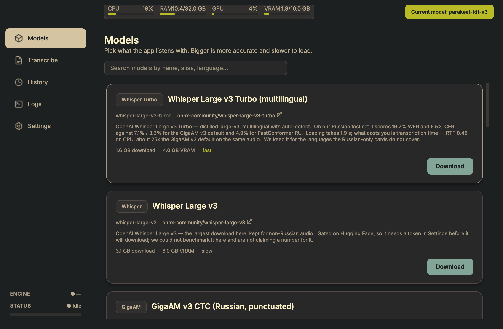
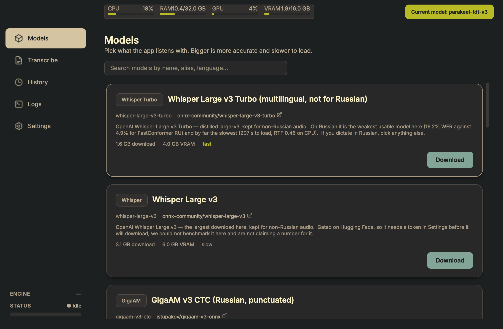
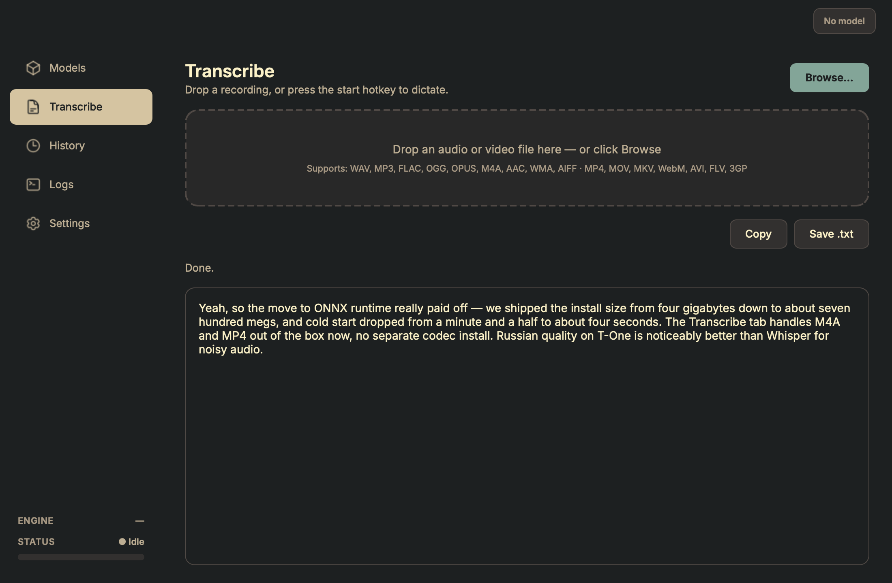
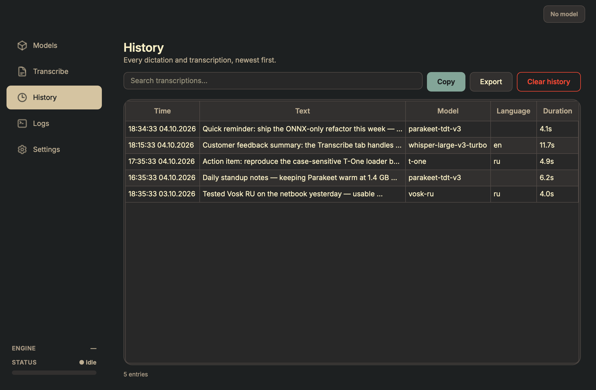
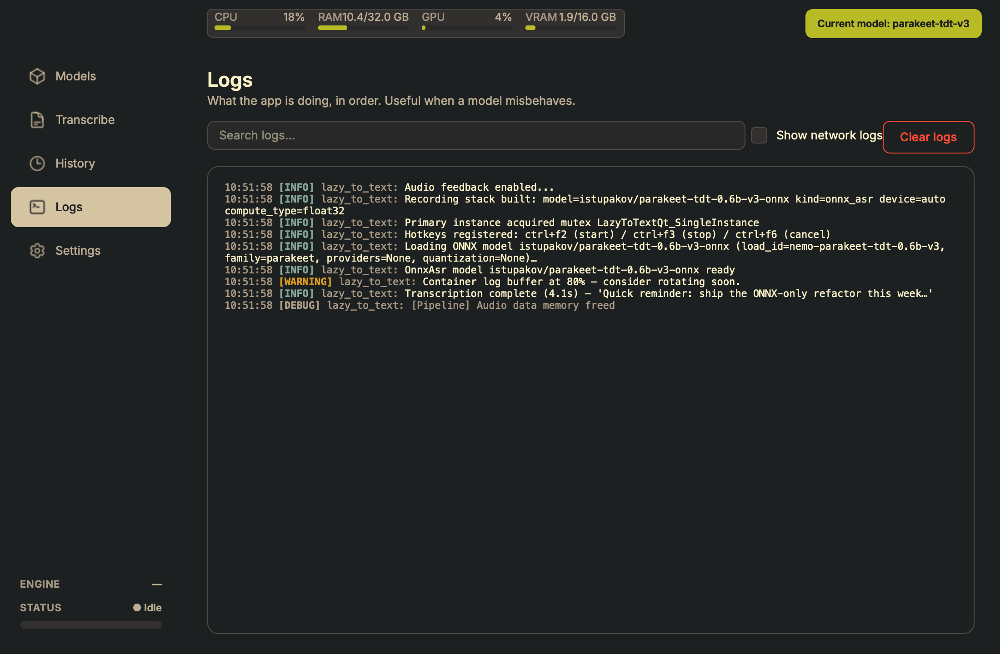
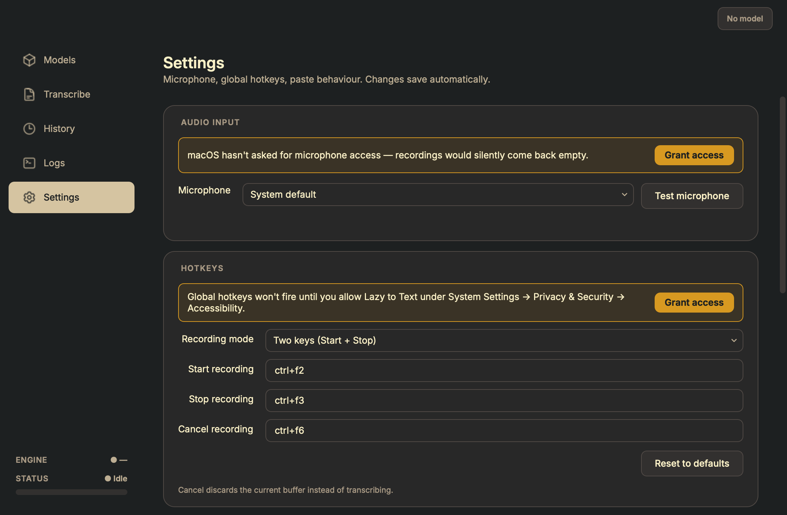

# Lazy to Text

Press a global hotkey, speak, paste.

Local speech-to-text for Windows and macOS. Recording, encoding and
inference all happen in-process — the internet is not involved after the
first model download.

[](https://www.python.org/)
[](https://doc.qt.io/qtforpython-6/)
[](https://onnxruntime.ai/)
[](https://github.com/istupakov/onnx-asr)
[](https://github.com/aa-blinov/lazy-to-text/releases/latest)
[](LICENSE)



---

## Install

Download the build for your platform from
[the latest release](https://github.com/aa-blinov/lazy-to-text/releases/latest).

| Platform | Asset | Download | Installed |
| --- | --- | --- | --- |
| Windows | `LazyToText-…-setup.exe` | 97,909,217 B | 402 MB |
| Windows | `LazyToText-…-windows-x64.zip` | 162,835,260 B | 402 MB |
| macOS | `Lazy-To-Text-…-macos-arm64.zip` | 159,349,810 B | 447 MB |

Every figure is a measurement of the attached file, not an estimate —
the release page states the exact names and sizes for its own build.

The Windows installer and the portable zip contain the same app; the
zip is for machines where you cannot run an installer. The macOS
archive unpacks to a double-clickable `.app`.

> **The macOS download is 152 MiB and it installs to 447 MB.** It used
> to be 528 MiB and 1.5 GB, and the gap was not this app's doing:
> `py2app` has to copy the whole Qt tree — naming Qt's submodules
> individually produces a bundle that dies at launch — so the bundle
> carried 589 MB of QtWebEngineCore plus its own ffmpeg, in a widgets
> application that never opens a web view. `scripts/prune_bundle.py`
> now removes the Qt this app never loads, after `py2app` and before
> signing. That took 1,018 MB out of the bundle and the download down by
> 71%. Windows never had the problem: PyInstaller prunes by import.

**On macOS**, the first launch needs two permissions — Accessibility
(for global hotkeys and the auto-paste keystroke) and Microphone (for
recording). macOS never prompts on its own, so Settings shows a banner
that links straight to the right System Settings pane. The grant
survives future updates.

## Screenshots

| Models | Transcribe |
| :---: | :---: |
|  |  |

| History | Logs |
| :---: | :---: |
|  |  |

| Settings |  |
| :---: | :---: |
|  |  |

## What it does

- **One hotkey in, text out.** `Ctrl+F2` records, `Ctrl+F3` stops,
  transcribes and pastes into whatever window has focus. All three are
  remappable, and they are different on macOS for a reason — see
  [Hotkeys](#hotkeys).
- **Eleven models, one inference path.** Every model loads through the
  same `OnnxAsrBackend` on
  [`onnx-asr`](https://github.com/istupakov/onnx-asr) and ONNX
  Runtime. No NeMo, no PyTorch, no CTranslate2 — adding a twelfth
  model is a registry entry, not a new dependency tree. Each card
  carries its **measured** accuracy and speed; see [Models](#models).
- **Transcribe files too.** Drop an audio or video file on the
  Transcribe tab. `soundfile` handles WAV / FLAC / OGG / OPUS / AIFF
  natively and a bundled static `ffmpeg` covers MP3 / M4A / AAC / WMA /
  MP4 / MOV / MKV / WebM / AVI / FLV / 3GP — no system-wide ffmpeg to
  install. The transcript is editable before you copy it, and the
  identity line says *Edited* when it no longer matches what the model
  returned.
- **Russian comes first.** The three most accurate models on our
  measured corpus are Russian-only, and all three weigh under 140 MB —
  Vosk RU small at 30 MB is the most accurate thing here. Every one of
  the top five covers Russian. GigaAM v3 restores punctuation and
  capitalisation, which is what makes it the default for text that
  lands in a document. Multilingual coverage comes from Parakeet TDT
  v3, Canary 1B v2 and Whisper.
- **Acceleration with an honest fallback.** CUDA / TensorRT on
  Windows, CoreML on Apple silicon. If the accelerator is missing — or
  a model trips it up — the app retries on CPU and the sidebar's engine
  pill names the provider actually in use, so a fallback is never a
  silent one.
- **Per-model settings, applied live.** Language, VAD, beam width,
  temperature and prompt for the Whisper cards; a narrower panel for
  the others. Persisted per alias and pushed into the running backend
  without a restart.
- **Diagnostics that are part of the product.** Live CPU / RAM / GPU
  meters in the topbar, a VU meter so a muted mic shows up before you
  finish speaking, colour-coded logs with network noise hidden by
  default, and a searchable history with export.
- **Feels like the platform.** The wheel is left to Qt, so trackpad
  momentum and pixel deltas work the way they do everywhere else. Item
  views scroll per pixel instead of snapping row to row. A state-aware
  tray icon, a single-instance guard, and a confirmation before
  anything destructive.
- **Small things that matter.** Clicked a 1.6 GB model by mistake? A
  Cancel pill rolls it back without waiting for the download. Every
  transcription pops a toast with a preview. `Ctrl+1..5` jumps between
  tabs.

## Quick start from source

Requires Python 3.12, [uv](https://docs.astral.sh.sh/uv/) and a
microphone.

```bash
git clone https://github.com/aa-blinov/lazy-to-text.git
cd lazy-to-text

uv sync                      # creates the venv from uv.lock
uv run lazy-to-text-ui       # launch the app
```

The first launch leaves no model loaded — pick one from the Models tab
and click **Download**. Weights land in `<project>/models/hub/`; the
path is overridable via Settings → Storage.

To transcribe a file instead of speaking, switch to the **Transcribe**
tab and drop one.

### Platform notes

- **Windows 10 / 11** — a CUDA-capable NVIDIA GPU is worth having for
  the larger models. Vosk, GigaAM and T-One are comfortable on CPU.
- **macOS 12+ on Apple silicon** — CoreML routes inference through the
  Neural Engine and GPU automatically. Intel Macs run on CPU.
- **Linux** — runs from source; there is no packaged build. The Linux
  CI leg exercises the suite under `xvfb-run`.

## Hotkeys

| Action | Default — Windows / Linux | Default — macOS | Configurable |
| --- | --- | --- | --- |
| Start recording | `Ctrl+F2` | `Ctrl+F8` | yes — Settings tab |
| Stop recording + transcribe | `Ctrl+F3` | `Ctrl+F9` | yes — Settings tab |
| Cancel current recording | `Ctrl+F6` | `Ctrl+F10` | yes — Settings tab |
| Switch tab (Models / Transcribe / History / Logs / Settings) | `Ctrl+1..5` | `Ctrl+1..5` | no |
| Open Settings | — | `Cmd+,` | no — App menu |
| Quit application | tray menu | `Cmd+Q` | no — App menu |
| Hide / show window | close button / tray click | close button / menu-bar click | no |

macOS reserves `Ctrl+F1`..`Ctrl+F7` for system-wide keyboard
navigation (focus → menu bar / Dock / window / toolbar / floating
window / next window / status menu). `pynput` never sees the
events because the OS captures them first, so we ship higher
F-keys as the per-platform defaults. Both sets are still freely
re-bindable.

Hotkey edits in the Settings tab persist immediately on focus loss; no Save
button. The auto-paste toggle behaves the same way and is also pushed live
into the running `ClipboardManager`.

## Models

Every model is an ONNX export downloaded from Hugging Face on first use.
The accuracy and speed columns are our own measurements, not vendor
figures: 400 clips from the Golos test split (370 of them in the
1554-word speech bucket, 1312 s), CPU, spoken numbers counted separately
because Golos spells digits out and every model here writes them as
digits. At that sample size the 95% interval is roughly ±1.0–1.8 points,
so read a gap under ~2 points as a tie.

| Alias | HF repo | Size | WER | RTF | Languages |
| --- | --- | --- | --- | --- | --- |
| `gigaam-v2` | `istupakov/gigaam-v2-onnx` | 889 MB | 3.5% | 0.015 | RU only |
| `vosk-ru-small` | `alphacep/vosk-model-small-ru` | 30 MB | 4.5% | 0.006 | RU only |
| `gigaam-multilingual-large-ctc` | `istupakov/gigaam-multilingual-large-ctc-onnx` | 564 MB | 4.6% | 0.028 | ru/kk/ky/uz/en |
| `vosk-ru` | `alphacep/vosk-model-ru` | 50 MB | 4.7% | 0.007 | RU only |
| `fastconformer-ru` | `istupakov/stt_ru_fastconformer_hybrid_large_pc_onnx` | 137 MB | 4.9% | 0.009 | RU only |
| `parakeet-tdt-v3` | `istupakov/parakeet-tdt-0.6b-v3-onnx` | 1.2 GB | 5.0% | 0.020 | 25 langs |
| `gigaam-multilingual-ctc` | `istupakov/gigaam-multilingual-ctc-onnx` | 225 MB | 6.2% | 0.026 | ru/kk/ky/uz/en |
| `gigaam-v3-ctc` *(default)* | `istupakov/gigaam-v3-onnx` | 260 MB | 7.1% | 0.018 | RU only |
| `gigaam-v3-rnnt` | `istupakov/gigaam-v3-onnx` | 290 MB | 7.4% | 0.012 | RU only |
| `t-one` | `t-tech/T-one` | 290 MB | 10.8% | 0.030 | RU only |
| `canary-1b-v2` | `istupakov/canary-1b-v2-onnx` | 2.0 GB | 11.4% | 0.059 | 25 langs |
| `whisper-large-v3-turbo` | `onnx-community/whisper-large-v3-turbo` | 1.6 GB | 16.2% | 0.457 | multilingual |
| `whisper-base` | `istupakov/whisper-base-onnx` | 107 MB | 55.6% | 0.039 | multilingual |
| `parakeet-ctc-0.6b` | `istupakov/parakeet-ctc-0.6b-onnx` | 623 MB | 122.8% | 0.019 | EN only |
| `parakeet-tdt-v2` | `istupakov/parakeet-tdt-0.6b-v2-onnx` | 2.3 GB | 124.4% | 0.020 | EN only |
| `parakeet-rnnt-0.6b` | `istupakov/parakeet-rnnt-0.6b-onnx` | 631 MB | 126.3% | 0.022 | EN only |

Sorted by measured WER, so the ranking is the argument. Three things
that number does not say on its own:

- **Punctuation is the default's whole job.** GigaAM v3 is 7.1% while
  Vosk Small is 4.5%, and the default is still the right pick for text
  that gets pasted into a document: it capitalises and punctuates the
  output itself. The CTC cards above it in the table return plain
  lowercase.
- **Spoken numbers split the table.** FastConformer RU, Parakeet TDT and
  GigaAM Multilingual write them correctly (0% WER); the GigaAM v3
  default and both Whisper cards garble them at 45–46%.
- **The Whisper card is the only reason to be multilingual, not a
  quality tier.** Whisper Large v3 Turbo is 16.2% on Russian — third
  worst of the cards that produce usable text, and thirty times worse
  than Vosk Small — for 1.6 GB and half a second of real time per minute
  of audio. It earns its place by covering languages nothing else here
  does. (The full Whisper Large v3 was measured and withdrawn: 15.5% at
  0.72 RTF in a precision that does not load, and 15.6% at 1.43 RTF in
  the one that does — the same accuracy as the Turbo for twice the
  download and a third of the speed.)

Golos is read speech with room tone — voice-assistant style commands,
two seconds each. Treat these as the floor of what the models handle
rather than the ceiling, and note that no test in this repository loads
a model at all; the numbers above come from a hand-run benchmark against
the real `RegistryBackend`, not from the suite.

## Configuration

`config.yaml` lives in the project root in dev mode (resolved by
walking up from the working directory to the nearest
`pyproject.toml`); when running from the `.app` bundle on macOS it
moves to `~/Library/Application Support/LazyToText/config.yaml`
(see *Where the bundle stores user data* above). Most fields are
exposed in the UI; the file is the source of truth.

```yaml
whisper:
  model: parakeet-tdt-v3        # any alias from app/model_mapping.py, or
                                # any HF repo path with an ONNX export
  device: auto                  # auto | cpu | cuda | coreml
                                # auto = CUDA on Windows w/ NVIDIA,
                                # CoreML on Apple Silicon, CPU otherwise
  compute_type: float32         # float16 | int8 | float32
  language: auto                # ISO code, or "auto" for auto-detect
                                # (only Whisper honours this)
  beam_size: 5                  # legacy field, ignored by ONNX path

# Per-model overrides — written by the inline Inference settings panel
# on the active card.  Each entry is keyed by alias.
model_overrides:
  whisper-large-v3-turbo:
    language: ru
    vad_filter: true
    beam_size: 7
    temperature: 0.0
    initial_prompt: "Anthropic, Claude, onnxruntime, GigaAM."
  parakeet-tdt-v3:
    timestamps: false
  gigaam-v3-rnnt: {}            # GigaAM ignores all of these (end-to-end)

hotkey:
  # Defaults differ per platform — see the Hotkeys section above
  # for why macOS uses higher F-keys.
  #   Windows / Linux: ctrl+f2 / ctrl+f3 / ctrl+f6
  #   macOS:           ctrl+f8 / ctrl+f9 / ctrl+f10
  start_recording_hotkey: ctrl+f2
  stop_recording_hotkey: ctrl+f3
  cancel_recording_hotkey: ctrl+f6

clipboard:
  auto_paste: true
  preserve_clipboard: false
  key_simulation_delay: 0.05

audio:
  channels: 1
  dtype: float32
  max_duration: 300
  device: 31                    # input device index from sounddevice;
                                # the Settings tab dropdown writes this

audio_feedback:
  enabled: true
  start_sound: assets/sounds/record_start.wav
  stop_sound: assets/sounds/record_stop.wav
  cancel_sound: assets/sounds/record_cancel.wav

storage:
  models_dir: ""                # empty = use default
                                #   dev:  <project>/models
                                #   .app: ~/Library/Caches/LazyToText/models
                                # — both created on first model download.

history:
  enabled: true
  max_entries: 1000
  auto_cleanup_days: 30
```

To reset settings, delete `config.yaml` and relaunch — defaults are written
back. Settings → Storage carries Reset / Move / Open-folder controls if
you only want to reset the storage path.

## Building a release bundle

### macOS first-run permissions

Two system prompts appear the first time you exercise the relevant
features:

- **Microphone** — requested from the Settings banner via
  AVFoundation. Click *Allow*; recording starts working in the same
  app session, no full restart needed.
- **Accessibility / keyboard access** — global hotkeys and macOS
  auto-paste both rely on Accessibility trust for the `.app` bundle.
  The Settings tab surfaces the relevant banners and can trigger the
  system request flow. If macOS refuses to prompt,
  open *System Settings → Privacy & Security → Accessibility* and add
  the binary you launch.

  Recommended path: build the proper `.app` bundle (next section)
  and add **`Lazy to Text.app`** instead of trying to whitelist
  `python3.12` from inside the venv — `.app` gives you a clean
  identity in the Accessibility list, persistent permissions
  across sessions, and a real Cmd-Tab title.

### Build a portable bundle

Both platforms have a packaging path that turns the source tree
into a drop-onto-another-machine artifact. The wrapper scripts
under `scripts/` handle every prerequisite step (icon refresh,
`uv sync`, codesign / runtime hook, …); pick the one matching
your OS.

#### macOS — `.app` via py2app

```bash
./scripts/build-macos.sh             # alias / dev (5–10 s)
open "dist/Lazy to Text.app"
```

The script invokes [`py2app`](https://py2app.readthedocs.io) in
**alias mode**: the `.app` is a thin shell that symlinks back into
the project's venv, so each build takes seconds and source edits
in `app/` are picked up on the next launch with no rebuild. The
host process now reports as **Lazy to Text** (not `python3.12`),
microphone / keyboard-access prompts use the bundle identifier
`ai.eora.lazytotext`, and the bundled icon is the same squircle
the in-app code paints.

The bundle ships the standard macOS App menu (under the Apple
logo): *About Lazy to Text*, *Settings…* (`Cmd+,`), and *Quit
Lazy to Text* (`Cmd+Q`). Window-close hides to the menu-bar tray;
`Cmd+Q` is the explicit full-quit path.

When you're ready to distribute:

```bash
./scripts/build-macos.sh --release   # full bundle, 5–10 minutes
```

…produces a self-contained `.app` (no venv dependency) under
`dist/`. Code signing is ad-hoc only; pair with an Apple Developer
ID + `xcrun notarytool submit` if you want to ship outside the
Mac App Store without Gatekeeper warnings.

##### Reproducible macOS build notes

The macOS packaging path is intentionally scripted so the same repo
state produces the same `.app` structure on another Mac with the same
Python / dependency lockfile. The moving parts are:

1. `scripts/build-macos.sh`
   - wipes `build/` and `dist/`
   - regenerates `app/assets/lazy_to_text.icns`
   - temporarily strips the `dependencies = [...]` block from
     `pyproject.toml`
   - runs `.venv/bin/python setup.py py2app` (or `py2app -A`)
   - ad-hoc signs the finished bundle with `codesign --deep --force`
2. `setup.py`
   - pins the bundle identifier to `ai.eora.lazytotext`
   - seeds `TCL_LIBRARY` / `TK_LIBRARY` from the live interpreter so
     `py2app`'s unconditional `tkinter` probe does not abort on the
     uv-managed Python runtime
   - patches built-in `zlib` for `py2app 0.28`, which otherwise
     assumes `zlib.__file__` exists in release mode
   - excludes `rubicon` and `tkinter`-related modules that are not
     needed by the app but can break the standalone build
   - force-includes runtime-critical packages such as `PySide6`,
     `onnxruntime`, `onnx_asr`, `pynput`, `sounddevice`,
     `_sounddevice_data`, `pyautogui`, and `platformdirs`

If you need to reproduce the release bundle from scratch on another
Mac, the shortest safe path is:

```bash
uv sync
./scripts/build-macos.sh --release
open "dist/Lazy to Text.app"
```

To install the built app the same way we do during local testing:

```bash
ditto "dist/Lazy to Text.app" "/Applications/Lazy to Text.app"
open -n "/Applications/Lazy to Text.app"
```

Useful verification commands:

```bash
codesign -dv "/Applications/Lazy to Text.app" 2>&1 | rg 'Identifier|Signature|TeamIdentifier'
shasum -a 256 "dist/Lazy to Text.app/Contents/MacOS/Lazy to Text" \
               "/Applications/Lazy to Text.app/Contents/MacOS/Lazy to Text"
```

If the app shows a generic `py2app` launch dialog, run the bundle's
real executable directly to see the Python traceback:

```bash
"/Applications/Lazy to Text.app/Contents/MacOS/Lazy to Text"
```

The runtime log for the frozen app lives at:

```text
~/Library/Logs/LazyToText/app.log
```

Important limitation: the build is signed ad-hoc, not with a stable
Developer ID certificate. macOS therefore treats each rebuilt app as a
new code identity for privacy permissions. After reinstalling a fresh
bundle into `/Applications`, you may need to re-grant
`Accessibility` for `Lazy to Text.app` before global hotkeys and
auto-paste keystrokes work again.

#### Windows — portable folder via PyInstaller

```powershell
.\scripts\build-windows.ps1                # default folder build
.\scripts\build-windows.ps1 -Clean         # nuke build/ + dist/ first
.\scripts\build-windows.ps1 -OneFile       # single-file .exe (slower start)
```

The default mode is a **folder bundle** under `dist\LazyToText\` —
copy the whole folder onto another Windows box, double-click
`LazyToText.exe`, and it runs. No admin rights, no PATH munging. This
is the *portable* variant; CI also compiles a Setup `.exe` for the same
build, and the release page carries both. `-OneFile` packs everything
into a single self-extracting `.exe` for cases where the folder
structure is inconvenient (slower startup, occasional false-positives
from heuristic AVs).

The build pulls hidden imports from `pywin32` (Win32 API),
`global_hotkeys` (system-wide hotkey listener), `PySide6.Qt*`,
and the full `onnx_asr` / `onnxruntime` submodule trees — anything
loaded via late-bound `importlib` that PyInstaller's static
analyser can't see. The runtime hook at
`scripts/pyi_runtime_hook.py` patches `sys.stdout` / `sys.stderr`
back to a discarding writer (windowed builds null them out, which
crashes any tqdm-using library), and adds `CREATE_NO_WINDOW` to
`subprocess.Popen` calls so child processes don't flash a
`cmd.exe` window.

#### Where the bundle stores user data

Both bundles set `sys.frozen` and switch over to per-user directories
via [`platformdirs`](https://github.com/tox-dev/platformdirs) — the
.app would otherwise have to write inside `/Applications` (read-only
without admin) and the Windows folder bundle would write inside
`Program Files` (same problem, plus AV / UAC pushback):

| Data | macOS `.app` | Windows portable |
| --- | --- | --- |
| `config.yaml` | `~/Library/Application Support/LazyToText/` | `%APPDATA%\LazyToText\` |
| `app.log` + history | `~/Library/Logs/LazyToText/` | `%LOCALAPPDATA%\LazyToText\Log\` |
| Model weights | `~/Library/Caches/LazyToText/models/` | `%LOCALAPPDATA%\LazyToText\Cache\models\` |

`uv run lazy-to-text-ui` (dev mode) keeps the legacy in-tree paths
(`<project>/config.yaml`, `<project>/logs`, `<project>/models`) so
iterating on source doesn't pollute the user dirs. The Storage card
in Settings can still override `models/` to any path — `HF_HOME` is
updated live, so the next download lands in the new dir without a
restart.

## Architecture

### Layer overview

```
                                 ┌─────────────────────────────┐
                                 │  Qt UI (app/gui)            │
                                 │  views, widgets, controllers│
                                 └─────────────┬───────────────┘
                                               │
                                 Qt signals    │
                                               ▼
┌─────────────┐    callbacks    ┌──────────────────────────────┐
│ Hotkey      ├────────────────▶│  StateManager  (app/)        │
│ Listener    │                 │  recording / processing /    │
└─────────────┘                 │  model_loading state machine │
                                 └─────┬───────────────┬─────────┘
                                       │               │
                            audio_data │               │ transcribe(audio)
                                       ▼               ▼
                          ┌──────────────────┐  ┌──────────────────────┐
                          │ AudioRecorder    │  │ TranscriptionBackend │
                          │ sounddevice +    │  │   (Protocol)         │
                          │ daemon thread    │  └─────────┬────────────┘
                          └──────────────────┘            │
                                                          ▼
                                          ┌────────────────────────────┐
                                          │ RegistryBackend  (façade)  │
                                          │ alias → canonical / family │
                                          │ / onnx_load_id; rebuilds   │
                                          │ inner on family change.    │
                                          └────────────┬───────────────┘
                                                       │
                                                       ▼
                                          ┌────────────────────────────┐
                                          │ OnnxAsrBackend             │
                                          │ family-aware (whisper /    │
                                          │ gigaam / parakeet);        │
                                          │ CUDA / CoreML → CPU        │
                                          │ fallback; 25 s chunking    │
                                          │ for long audio.            │
                                          └────────────┬───────────────┘
                                                       │
                                                       ▼
                                          ┌────────────────────────────┐
                                          │ onnx-asr + onnxruntime     │
                                          │ (CUDA on Windows, CoreML   │
                                          │  on Apple Silicon, CPU     │
                                          │  everywhere)               │
                                          └────────────────────────────┘
```

### Module layout

```
app/
├── gui/                                   ← Qt UI (everything user-facing)
│   ├── app.py                                application entry point + main()
│   ├── main_window.py                       sidebar + stacked views shell
│   ├── recording_factory.py                 builds the StateManager + backend stack
│   ├── refresh_rate.py                      display-aware tick interval helper
│   ├── smooth_scroll.py                     per-pixel scroll mode + sane wheel step
│   ├── theme.py / log_bridge.py             design tokens + logging→Qt bridge
│   ├── controllers/
│   │   ├── app_controller.py                  AppController orchestrator (815 LOC)
│   │   │                                      ├ Models tab wiring
│   │   │                                      ├ Shortcuts/Settings + mic test
│   │   │                                      └ Recording state + cancel-load
│   │   ├── _history_mixin.py                  HistoryMixin (clear / export / toast)
│   │   ├── _storage_mixin.py                  StorageMixin (path / size / Open folder)
│   │   ├── _transcribe_mixin.py               TranscribeMixin (file dispatch)
│   │   ├── _tray_mixin.py                     TrayMixin (show / quit)
│   │   └── recording_controller.py            QObject wrapper over StateManager
│   ├── views/                              one widget per sidebar tab
│   │   ├── models_view.py / history_view.py / logs_view.py
│   │   ├── shortcuts_view.py / transcribe_view.py / placeholder.py
│   ├── widgets/                            building blocks
│   │   ├── model_card.py / sidebar.py / topbar.py / toast.py
│   │   ├── inference_settings_panel.py        Whisper-style 5-knob panel
│   │   ├── parakeet_inference_settings_panel.py  Parakeet timestamps toggle
│   │   ├── recording_status_widget.py / vu_meter.py / resource_widget.py
│   │   ├── tray_icon.py / flow_layout.py
│   │   └── styles/                            dark.qss + Heroicon SVGs
│   └── styles/dark.qss                     stylesheet (color tokens templated in)
├── backends/                              ← ASR inference (single engine)
│   ├── base.py                              TranscriptionBackend Protocol
│   ├── onnx_backend.py                      OnnxAsrBackend (the actual inference)
│   ├── registry_backend.py                  RegistryBackend (alias resolution façade)
│   └── _progress.py                         tqdm hook for HF download progress
├── state_manager.py                       ← domain: recording / processing FSM
├── audio_recorder.py                      ← domain: sounddevice capture
├── audio_feedback.py                      ← domain: start/stop sounds
├── clipboard_manager.py                   ← domain: paste delivery
├── config_manager.py                      ← domain: yaml read/write
├── history_manager.py                     ← domain: transcription history JSON
├── hotkey_listener.py                     ← domain: cross-platform hotkey binding
│                                            (global-hotkeys on Win,
│                                             native AppKit monitor on macOS,
│                                             pynput on Linux)
├── instance_manager.py                    ← domain: single-instance lock
│                                            (named mutex on Win, filelock elsewhere)
├── model_mapping.py                       ← domain: registry of supported models
├── inference_settings.py                  ← domain: per-model settings dataclasses
├── resource_monitor.py                    ← domain: CPU/RAM/GPU sampler
└── utils.py                               ← domain: cache/path helpers
```

### Layering rules

- **`app/gui/`** is the only layer allowed to import Qt.  Everything
  else (`backends/`, the domain modules at `app/`'s root) is plain
  Python with no UI dependencies — they're easy to test in isolation
  and swap engines without touching the UI.
- **`app/backends/`** depends on `app.utils` and `app.inference_settings`
  but knows nothing about Qt.  Cross-engine swaps go through
  `RegistryBackend` which resolves the alias from `model_mapping`.
- **Domain modules** at `app/`'s root depend on each other via
  Protocols (`TranscriptionBackend`, etc.) — no circular imports, the
  dependency graph fans inward toward `utils`.
- **`AppController`** is mixin-composed: each side-feature (Storage,
  Transcribe, Tray, History) lives in its own `_*_mixin.py` so the
  orchestrator file stays focused on the model-load + recording loop.

For file transcription, `OnnxAsrBackend.transcribe_file(path)` decodes
the file via `soundfile` first; on failure it falls back to a bundled
static `ffmpeg` from `imageio-ffmpeg` (raw PCM through stdout pipe — no
temp files, the user's source file is never modified or copied).

There's no splash screen — ONNX loads in 3–5 s with no GIL-blocking
cold import, so the main window appears immediately and the model
becomes ready in the background.

## Hardware acceleration

`device: auto` (the default in `config.yaml`) is platform-aware:

- **Windows**: ONNX Runtime picks `CUDAExecutionProvider` when
  `onnxruntime-gpu` is installed (it is, via the `[gpu]` extra) and
  a working NVIDIA driver is present, falling back to CPU otherwise.
  Explicit overrides: `device: cuda` or `device: cpu`.
- **macOS**: the backend stages
  `CoreMLExecutionProvider` ahead of CPU with
  `ModelFormat=MLProgram` and `MLComputeUnits=ALL`, so CoreML's
  dispatcher routes ops to Neural Engine / GPU / CPU per-op.
  Explicit overrides: `device: coreml` or `device: cpu`.

Both platforms retry on CPU automatically if the accelerator session
fails at session-create time (driver missing, op unsupported by the
EP, etc.). The Logs view surfaces the retry as a warning.

CPU-only is fine for `vosk-ru-small`, `vosk-ru`, `t-one`, and
`gigaam-v3-ctc`. The larger Whisper / Parakeet / Canary models
(`whisper-large-v3*`, `parakeet-tdt-v3`, `canary-1b-v2`) are usable
on CPU but noticeably slower; CUDA on Windows or CoreML on Apple
Silicon brings them down to a few seconds for a 1-minute clip.

## Development

```bash
uv sync                                        # production deps + dev tools
uv run pytest                                  # full test suite (590+ tests)
uv run lazy-to-text-ui                         # launch from source
uv run python scripts/generate_screenshots.py  # regenerate docs/screenshots
```

Tests live in `tests/` and use `pytest-qt`. Cross-thread paths (resource
monitor, mic test, model load, file transcription) are covered with
fakes that don't touch the actual hardware or libraries — the suite runs
in ~30 s without ever hitting the network or instantiating an ONNX
session.

## Roadmap

- [ ] Onboarding overlay for first-launch users (which model to pick, how the hotkey works)
- [ ] Per-model VRAM forecasting that warns before downloading something the GPU can't fit
- [ ] Light theme + theme switcher
- [ ] Word-level timestamps for the file-transcribe view (the underlying `onnx-asr` already supports them)
- [ ] Speaker diarisation (file transcribe → labelled segments)

## Tech stack

- Python 3.12
- PySide6 (Qt 6.11) for the UI, bundled Inter Variable + Heroicons
- [onnx-asr](https://github.com/istupakov/onnx-asr) +
  [ONNX Runtime](https://onnxruntime.ai/) for the single inference
  path — covers Whisper, GigaAM, Parakeet, Canary, T-One, Vosk under
  one API. Windows ships `onnxruntime-gpu` (CUDA + TensorRT), macOS
  ships plain `onnxruntime` (CoreMLExecutionProvider for Apple
  Silicon)
- [`soundfile`](https://github.com/bastibe/python-soundfile) (libsndfile)
  for native audio decoding (WAV / FLAC / OGG / OPUS / AIFF)
- [`imageio-ffmpeg`](https://github.com/imageio/imageio-ffmpeg) —
  bundled static ffmpeg binary for the MP3 / M4A / MP4 / MKV / WebM
  file path
- `sounddevice` for audio capture, `pyperclip` for clipboard text
- Hotkeys + auto-paste:
  Windows uses `global-hotkeys` + `pywin32` (native `RegisterHotKey`
  + `keybd_event`);
  macOS uses a native AppKit keyboard monitor for hotkeys plus
  Accessibility-targeted key delivery for auto-paste (with Quartz as a
  fallback);
  Linux uses [`pynput`](https://pynput.readthedocs.io/) for hotkeys
- Sound feedback: `winsound` (Windows) / [`playsound3`](https://github.com/szmikler/playsound3)
  (macOS via AppKit, Linux via GStreamer)
- Single-instance lock: native named mutex on Windows, `filelock`
  lockfile elsewhere
- Cross-platform user dirs via [`platformdirs`](https://platformdirs.readthedocs.io/)
- `psutil` for CPU / RAM, `nvidia-ml-py` (Windows-only) for the GPU
  topbar widget

## Acknowledgements

- [onnx-asr](https://github.com/istupakov/onnx-asr) — the universal ONNX
  loader that made the single-engine refactor possible.
- [OpenAI Whisper](https://github.com/openai/whisper) — the underlying
  multilingual model; ONNX exports by [onnx-community](https://huggingface.co/onnx-community).
- [GigaAM](https://github.com/salute-developers/GigaAM) (Sber) — the
  Russian-specialised acoustic model.
- [T-One](https://huggingface.co/t-tech/T-one) (T-Tech) — Russian
  Conformer-CTC trained on 80k hours of speech.
- [Vosk](https://alphacephei.com/vosk/) (alphacephei) — the lightweight
  Zipformer Russian models.
- [Parakeet TDT v3](https://huggingface.co/nvidia/parakeet-tdt-0.6b-v3)
  and [Canary v2](https://huggingface.co/nvidia/canary-1b-v2) (NVIDIA) —
  the multilingual European-language engines.
- [imageio-ffmpeg](https://github.com/imageio/imageio-ffmpeg) — bundled
  static ffmpeg.
- [Heroicons](https://heroicons.com) (Tailwind Labs) — sidebar icons.
- [Inter](https://rsms.me/inter/) (Rasmus Andersson) — bundled UI font.
- UI direction borrowed from [Spokenly](https://spokenly.app/) (macOS).

## License

[MIT](LICENSE)
